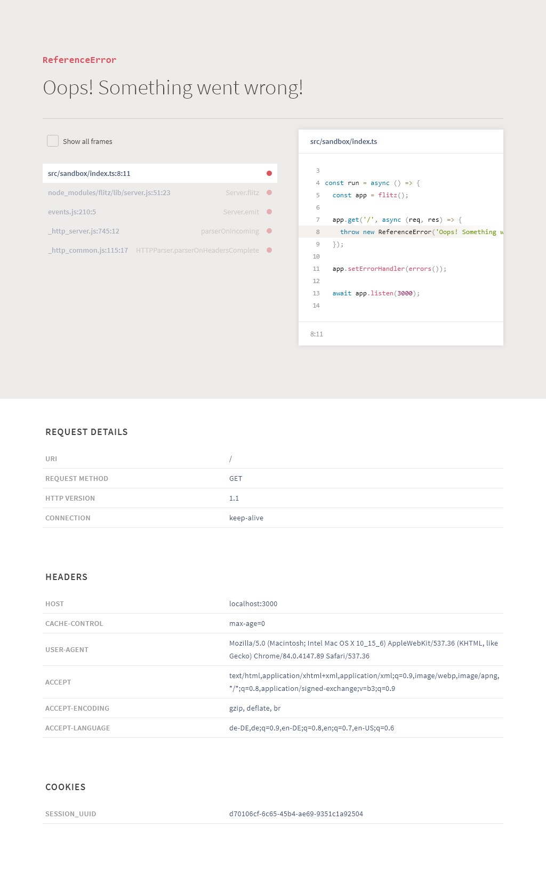

[](https://www.npmjs.com/package/@flitz/errors) [](https://github.com/flitz-js/flitz) [](https://github.com/flitz-js/errors/actions?query=workflow%3APublish) [](https://github.com/flitz-js/errors/pulls)

# @flitz/errors

> Creates an error handler for [flitz](https://github.com/flitz-js/flitz) with [pretty HTML output](https://github.com/poppinss/youch).

## Install

Run

```bash
npm install --save @flitz/errors
```

from the folder, where your `package.json` is stored.

## Usage

```javascript
const flitz = require('flitz');
const errors = require('@flitz/errors');

const run = async () => {
  const app = flitz();

  app.get('/', async (req, res) => {
    throw new ReferenceError('Oops! Something went wrong!');
  });

  app.setErrorHandler(errors());

  await app.listen(3000);
};

run();
```

Or the TypeScript way:

```typescript
import flitz from 'flitz';
import { errors } from '@flitz/errors';

const run = async () => {
  const app = flitz();

  app.get('/', async (req, res) => {
    throw new ReferenceError('Oops! Something went wrong!');
  });

  app.setErrorHandler(errors());

  await app.listen(3000);
};

run();
```

A possible result could be (the `Show all frames` was checked when took screenshot btw.):



## TypeScript

TypeScript is optionally supported. The module contains its own [definition files](https://www.typescriptlang.org/docs/handbook/declaration-files/introduction.html).

## Credits

The module makes use of:

* [Youch!](https://github.com/poppinss/youch) by [Poppinss](https://github.com/poppinss)

## License

MIT © [Marcel Kloubert](https://github.com/mkloubert)
